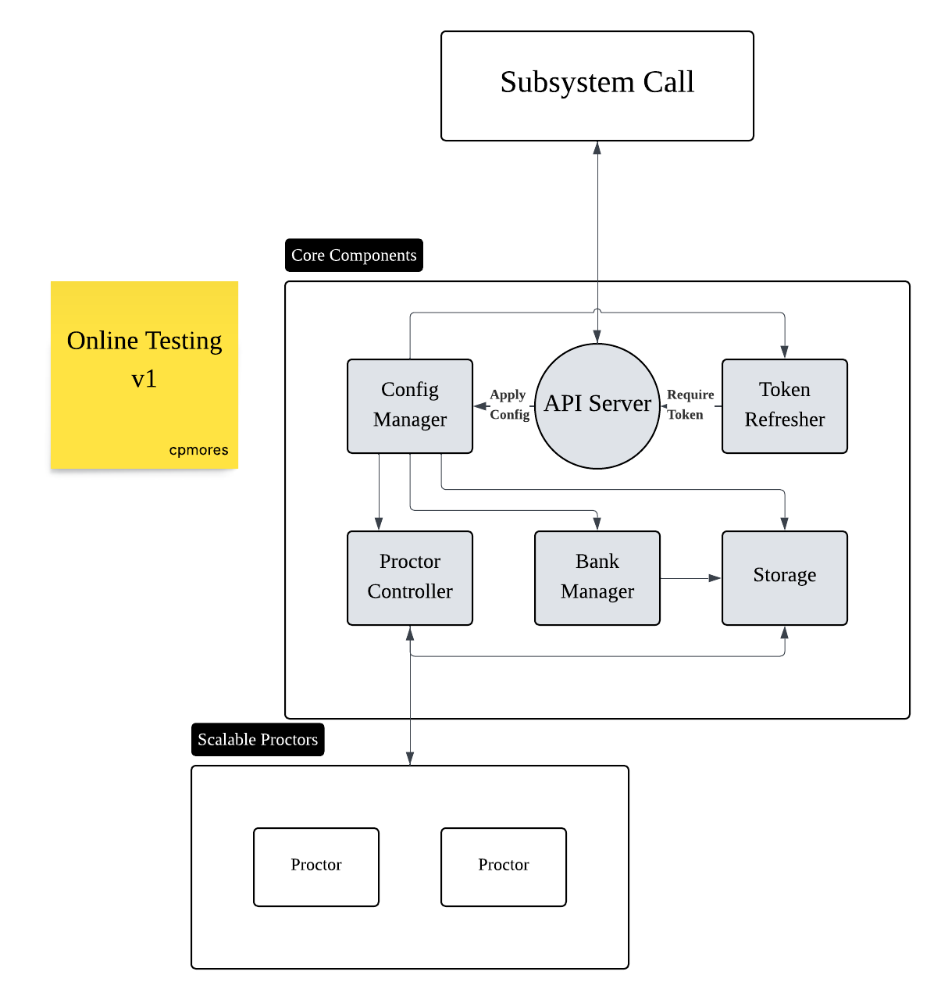

# Technical Overview

STSS(Smart Teaching Service System) is based on the university network
and hire AI techniques to provide smart service for the teaching activities. Online Testing, as a significant part of this system, is required to be able to handle thousands of connections at the same time, which implies **scalable** and **stable**.

## Project Components

STSS-OnlineTesting is mainly a centralized API with scalable modules.

The key OT components are the API Server, the Config Manager, the Token Refresher, Proctor Controller, Bank Manager and Storage.

+ **API Server**: This component provides a HTTP RESTful entrypoint to manage services within the core components.

+ **Config Manager**: This component receives commands from API server and do the real operations on other components, not only the requests from other subsystems, but also from the **STSS-Frontend**.

+ **Token Refresher**: This component is used to refresh **server tokens**(which ensure security, maybe depreciated)

+ **Proctor Controller**: This component monitor proctor connections, assign and release proctor resources according to peak of connection, which ensures the stability of online exams.

+ **Bank Manager**: This component deals with operations for bank and exam CRUD.

+ **Storage**: At now, this component is mainly based on **Redis** and **Mysql**. Redis is used for the quickly updated info during real-time exams, while Mysql saves all the information it gets from **IM, ACA, SCS and frontend**. 

## Scripts

TODO: Test

## Makefile Commands

TODO

